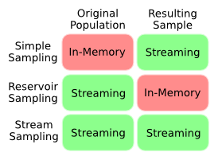

# Random Sampling in Clojure
============================

## Installation

`sampling` is available as a Maven artifact from
[Clojars](http://clojars.org/bigml/sampling).

For [Leiningen](https://github.com/technomancy/leiningen):

```clojure
[bigml/sampling "2.1.1"]
```

## Overview

This library supports three flavors of random sampling:
[simple sampling](#simple-sampling),
[reservoir sampling](#reservoir-sampling),
and [stream sampling](#stream-sampling).

Simple sampling is the best choice if the data is small enough to
comfortably keep in memory.  If that's not true but the sample you
want to take is small enough for memory, then reservoir sampling is a
good choice.  If neither the original population nor the sample can
reside in memory, then take a look at stream sampling.



As we review each, feel free to follow along in the REPL:

```clojure
user> (ns test
        (:require (bigml.sampling [simple :as simple]
                                  [reservoir :as reservoir]
                                  [stream :as stream])
                  (bigml.sampling.test [stream :as stream-test])))
```

## Simple Sampling

`sample.simple` provides simple random sampling.  With this technique
the original population is kept in memory but the resulting sample is
a lazy sequence.

By default, sampling is done [without replacement]
(http://www.ma.utexas.edu/users/parker/sampling/repl.htm). This
is equivalent to a lazy [Fisher-Yates shuffle]
(http://en.wikipedia.org/wiki/Fisher%E2%80%93Yates_shuffle).

```clojure
test> (simple/sample (range 5))
(2 3 1 0 4)
```

Setting `:replace` as true will sample with replacement.  Since there
is no limit to the number of items that may be sampled with
replacement from a population, the result will be an infinite length
list.  So make sure to `take` however many samples you need.

```clojure
test> (take 10 (simple/sample (range 5) :replace true))
(2 3 3 2 4 1 1 1 3 0)
```

Each call to `simple/sample` will return a new sample order.

```clojure
test> (simple/sample (range 5))
(0 2 3 1 4)
test> (simple/sample (range 5))
(3 1 4 2 0)
```

Setting the `:seed` parameter allows the sample order to be recreated.

```clojure
test> (simple/sample (range 5) :seed 7)
(1 3 2 0 4)
test> (simple/sample (range 5) :seed 7)
(1 3 2 0 4)
```

Any value that's hashable is valid as a seed:

```clojure
test> (simple/sample (range 5) :seed :foo)
(2 1 3 0 4)
```

The underlying random number generator may also be selected with the
`:generator` parameter.  The two options are `:lcg`
([linear congruential generator]
(http://en.wikipedia.org/wiki/Linear_congruential_generator))
and `:twister`
([Marsenne twister]
(http://en.wikipedia.org/wiki/Mersenne_twister)).
The default is `:lcg`.

```clojure
test> (simple/sample (range 5) :seed 7 :generator :lcg)
(1 3 2 0 4)
test> (simple/sample (range 5) :seed 7 :generator :twister)
(1 2 0 3 4)
```

### Weighted Simple Sampling

A sample may be weighted using the `:weigh` parameter.  If the
parameter is supplied with a function that takes an item and produces
a non-negative weight, then the resulting sample will be weighted
accordingly.

```clojure
test> (take 5 (simple/sample [:heads :tails]
                             :weigh {:heads 0.5 :tails 0.5}
                             :replace true))
(:tails :heads :heads :heads :tails)
```

The weights need not sum to 1.

```clojure
test> (frequencies (take 100 (simple/sample [:heads :tails]
                                            :weigh {:heads 2 :tails 1}
                                            :replace true)))
{:heads 66, :tails 34}
```

## Reservoir Sampling

`sample.reservoir` provides functions for [reservoir sampling]
(http://en.wikipedia.org/wiki/Reservoir_sampling).  Reservoir sampling
keeps the sampled population in memory (the 'reservoir').  However,
the original population is streamed through the reservoir so it does
not need to reside in memory.  This makes reservoirs useful when the
original population is too large to fit into memory or the overall
size of the population is unknown.

To create a sample reservoir, use `reservoir/create` and give it the
number of samples you desire.  The resulting reservoir acts as a
collection, so you can simply `conj` values into the reservoir to
create a sample.  For example:

```clojure
test> (reduce conj (reservoir/create 3) (range 10))
(5 7 2)
```

Similarly, a collection can be fed into the reservoir with `into`:

```clojure
test> (into (reservoir/create 3) (range 10))
(7 0 8)
```

To see how the reservoir changes as items are added, we can use
`reductions`:

```clojure
test> (reductions conj (reservoir/create 3) (range 10))
(() (0) (0 1) (0 1 2) (0 3 2) (0 3 2) (5 3 2) (6 3 2) (6 3 2) (6 3 2) (6 9 2))
```

For convenience, `reservoir/sample` accepts a collection and a
reservoir size and returns the final reservoir:

```clojure
test> (reservoir/sample (range 10) 5)
(0 9 2 1 4)
```

Both `reservoir/sample` and `reservoir/create` support the `:replace`,
`:seed`, `:generator`, and `:weigh` parameters.

```clojure
test> (reservoir/sample (range 10) 5 :replace true :seed 1 :weigh identity)
(9 7 5 5 8)
```

One caveat is that samples for reservoirs using `:weigh` won't be in a
random order (with respect to item weights).  So you may need to
shuffle the results if that's important for you.

### Merging Reservoirs

Reservoirs may be merged with `reservoir/merge`. The resulting sample
will be similar to a single reservoir over the entire population.  For
example:

```clojure
test> (reduce + (reservoir/sample (range 0 10000) 500))
2517627

test> (reduce + (reservoir/merge
                 (reservoir/sample (range 0 5000) 500)
                 (reservoir/sample (range 5000 8000) 500)
                 (reservoir/sample (range 8000 10000) 500)))
2527384
```

With `reservoir/merge`, reservoirs may be built in parallel on subsets
of the population and combined afterwords, even if the subsets are of
varying size.

### Reservoir Implementations

Lastly, there are two implementations of reservoir sampling available:
`:insertion` and `:efraimdis`.  `:efraimdis` is the default and
generally the better option.  `:insertion` does not support the
`:weigh` parameter, however it can be faster when sampling from
small-ish populations or when sampling with replacement.

The implementation may be selected when calling either
`reservoir/sample` or `reservoir/create` by using the
`:implementation` parameter:

```clojure
test> (time (count (reservoir/sample (range 10000) 2000
                                     :implementation :efraimdis
                                     :replace true)))
"Elapsed time: 4197.798 msecs"
2000
test> (time (count (reservoir/sample (range 10000) 2000
                                     :implementation :insertion
                                     :replace true)))
"Elapsed time: 651.868 msecs"
2000
```

## Stream Sampling

`sample.stream` is useful when taking a large sample from a large
population. Neither the original population or the resulting sample
are kept in memory.  There are a couple of caveats.  First, unlike the
other sampling techniques, the resulting sample stream is not in
random order.  It will be in the order of the original population.  So
if you need a random ordering, you'll want to shuffle the sample.  The
second caveat is that, unlike reservoir sampling, the size of the
population must be declared up-front.

To use stream sampling, call `stream/sample` with the population, the
desired number of samples, and the size of the population.  The result
is a lazy sequence of samples.

As an example, we take five samples from a population of ten values:

```clojure
test> (stream/sample (range) 5 10)
(1 2 4 7 9)
```

As elsewhere, `stream/sample` supports `:replace`, `:seed`, and
`:generator`:

```clojure
test> (stream/sample (range) 5 10 :replace true :seed 2)
(2 3 6 7 7)
```

### Out-of-bag Items

If an item isn't selected as part of a sampling, it's called
*out-of-bag*.  Setting the `:out-of-bag` parameter to true will return
a sequence of the out-of-bag items instead of the sampled items.  This
can be useful when paired with `:seed`.

```clojure
test> (stream/sample (range) 7 10 :seed 0)
(0 2 3 5 6 7 9)
test> (stream/sample (range) 7 10 :seed 0 :out-of-bag true)
(1 4 8)
```

### Rate

It's computationally expensive to select the exact number of desired
samples when using `stream/sample` with replacement.  If you're okay
with the number of samples being approximately the desired number,
then you can set `:rate` to true to decrease the computation cost.
When this is the case, the probability of selecting an item will be
calculated only once and then applied to each item in the population
independently.  As an example:

```clojure
test> (time (count (stream/sample (range 10000) 5000 10000
                                  :replace true)))
"Elapsed time: 374.021 msecs"
5000
test> (time (count (stream/sample (range 10000) 5000 10000
                                  :replace true :rate true)))
"Elapsed time: 33.923 msecs"
4954
```

`:rate` is also useful if you want to sample the population at a
particular rate rather than collect a specific sample size.

To illustrate, when `stream/sample` is given an infinite list of
values as the population, the default behavior is to take the
requested samples from the expected population.  In this case, it
means taking exactly one sample from the first thousand values of the
population:

```clojure
test> (stream/sample (range) 1 1000)
(229)
```

However, when `:rate` is true the resulting sample is also infinite,
with each item sampled at a probability of `1/1000`:

```clojure
test> (take 10 (stream/sample (range) 1 1000 :rate true))
(1149 1391 1562 3960 4359 4455 5141 5885 6310 7568 7828)
```

### Cond-Sample

While stream sampling does not yet support sample weights, the
`cond-sample` fn can be useful for fine tuned sampling.

`cond-sample` accepts a collection followed by pairs of clauses and
sample definitions.  A clause should be a function that accepts an
item and returns either true of false.  After each clause should
follow a sample defition that describes the sampling technique to use
when the condition is true.

As an example, we'll use the well known [iris dataset]
(http://en.wikipedia.org/wiki/Iris_flower_data_set):
```clojure
test> (first stream-test/iris-data)
[5.1 3.5 1.4 0.2 "Iris-setosa"]
```

There are 50 instances of each species:
```clojure
test> (frequencies (map last stream-test/iris-data))
{"Iris-setosa" 50, "Iris-versicolor" 50, "Iris-virginica" 50}
```

Let's say we want to sample all of `Iris-setosa`, half as many
`Iris-versicolor`, and none of the `Iris-virginica`.  If you knew the
population for each class ahead of time, you could use `cond-sample`
like so:

```clojure
test> (def new-sample
         (stream/cond-sample stream-test/iris-data
                             #(= "Iris-setosa" (last %)) [50 50]
                             #(= "Iris-versicolor" (last %)) [25 50]
                             #(= "Iris-virginica" (last %)) [0 50]))
test> (frequencies (map last new-sample))
{"Iris-setosa" 50, "Iris-versicolor" 25}
```

If you did not know the class populations ahead of time, a similar
sample could be done using `:rate`.  Also, an item that doesn't
satisfy any condition will be left out of the final sample.  So
`Iris-virginica` does not need to have its own clause:

```clojure
test> (def new-sample
         (stream/cond-sample stream-test/iris-data
                             #(= "Iris-setosa" (last %)) [1 1 :rate true]
                             #(= "Iris-versicolor" (last %)) [1 2 :rate true]))
test> (frequencies (map last new-sample))
{"Iris-setosa" 50, "Iris-versicolor" 23}
```

### Multi-Sample

The `stream/multi-sample` fn can be used to generate multiple
samplings in one pass over the population.  The fn takes the
population followed by sets of sampling parameters, one for each
desired sampling.

Each set of sample parameters should be composed of a consumer fn, the
sample size, the population size, and optionally the parameters
`:replace`, `:seed`, and `:rate`.

`multi-sample` will generate a unique sampling for every parameter
set.  Whenever a value is sampled, it will be consumed by the
parameter set's consumer fn.  A consumer fn should accept a single
parameter.

As an example, let's imagine we're running a retail store and want to
distribute awards to the stream of customers entering the store.  To
do this we'll create two samplings from the customer stream: 1 out of
100 will win a gift certificate and 1 out of 500 will win a Hawaiian
vacation.

```clojure
test> (defn award-gift-certificate! [customer-id]
        (println "Customer" customer-id "wins a gift certificate."))
test> (defn award-hawaiian-vacation! [customer-id]
        (println "Customer" customer-id "wins a Hawaiian vacation."))
test> (def customer-ids (range 1000))
test> (stream/multi-sample customer-ids
                           [award-gift-certificate! 1 100 :rate true]
                           [award-hawaiian-vacation! 1 500 :rate true])
Customer 161 wins a Hawaiian vacation.
Customer 427 wins a gift certificate.
Customer 627 wins a gift certificate.
Customer 646 wins a gift certificate.
Customer 661 wins a gift certificate.
Customer 731 wins a gift certificate.
Customer 745 wins a gift certificate.
Customer 786 wins a gift certificate.
Customer 794 wins a gift certificate.
Customer 833 wins a Hawaiian vacation.
Customer 836 wins a gift certificate.
```

### Multi-Reduce

`multi-reduce` is very similar to `multi-sample`, except every set of
sample parameters defines a sampling along with a reduction function.
So each set of sample parameters should be composed of a reduce fn, an
initial reduce value, the sample size, the population size, and
optionally the `:replace`, `:seed`, and `:rate` parameters.

`multi-reduce` will return a seq of values, each value being the final
reduction for a sampling.  A reducer fn should accept two parameters.

An example:

```clojure
test> (stream/multi-reduce (range) [+ 0 20 30 :seed 3]
                                   [+ 0 20 30 :seed 4])
(269 291)
```

## License

Copyright (C) 2013 BigML Inc.

Distributed under the Apache License, Version 2.0.
